<h4> Issue </h4>

```http://lab6.eastus.cloudapp.azure.com:8120``` is inaccesible by its DNS/IPv4 address

```http://localhost:8090``` is inaccessible from health-check service

<h4>Checking my endpoints from the VM</h4>

<h4>8080</h4>

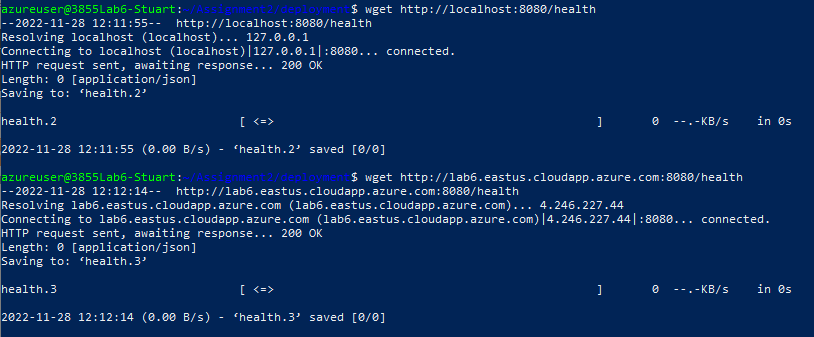

<h4>8090</h4>

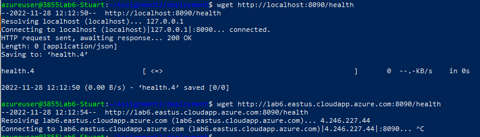

<h4>8100</h4>

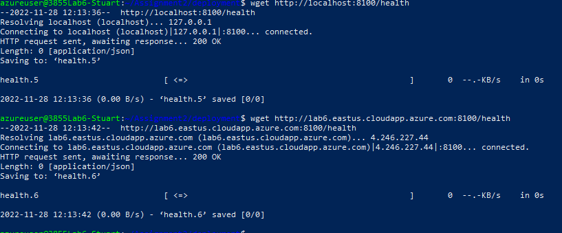

<h4>8110</h4>

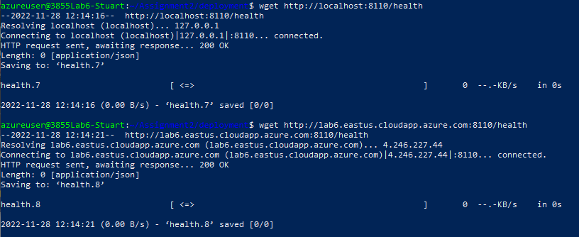

<h4>8120</h4>

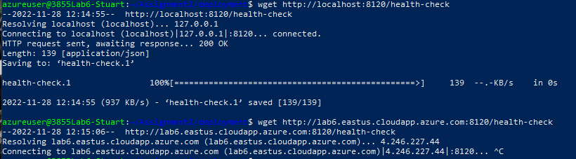

<h4>Results of health-check.1</h4>

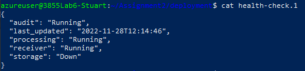

<h4>Checking receiver, storage, and health-check endpoints from health-check container<h4>

<h4>8080</h4>

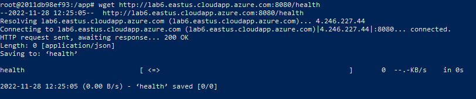

<h4>8090</h4>

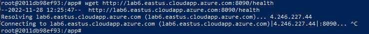

<h4>8120</h4>

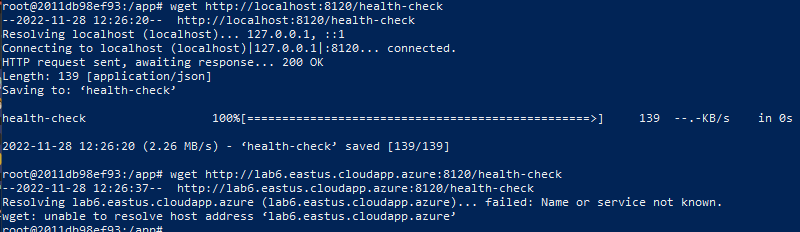

<h4>Checking receiver, storage, and health-check endpoints from processing container</h4>

<h4>8080</h4>

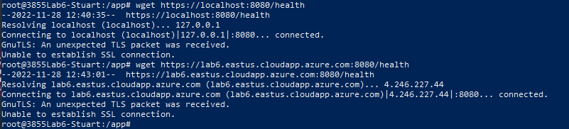

<h4>8090</h4>

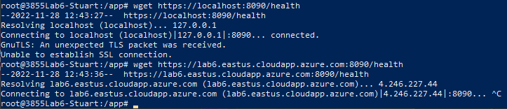

<h4>8120</h4>

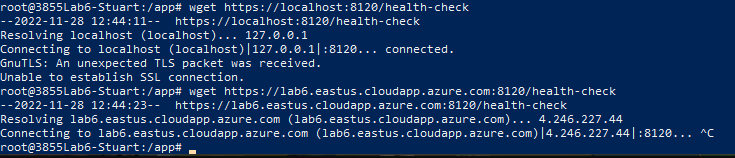